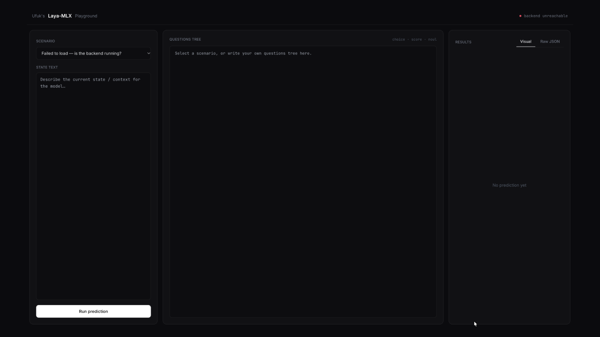

# Ufuk's Laya-MLX Playground

A minimalist playground for the [laya-mlx](https://github.com/mizorewww/laya-mlx) typed decision model (`aac6fef/laya-mlx`). Backed by FastAPI.



## Requirements

- Apple Silicon Mac
- Python 3.11+

## Install

```bash
cd playground
python3.11 -m venv venv
source venv/bin/activate
pip install -r requirements.txt
```

## Run

```bash
uvicorn main:app --reload
```

Then open `http://127.0.0.1:8777`. 

The model downloads once on first run (~800MB from Hugging Face) and then stays resident in memory for the life of the process.

## Files

| File | Purpose |
|---|---|
| `main.py` | FastAPI app. Loads the model at startup, exposes `GET /api/scenarios` and `POST /api/predict`. |
| `index.html` | The playground UI — scenario picker, state text, questions editor, results panel. |
| `scenarios.json` | The predefined scenarios shown in the dropdown. Edit or add entries here; no code changes needed. |

## Using it

1. Pick a scenario from the dropdown (left panel), or write your own `state_text` and a questions tree (middle panel) from scratch.
2. Click **Run prediction**.
3. The right panel shows the latency, each question's answer with probability bars, and a **Raw JSON** tab with the exact API response.

### Questions tree format

```json
{
  "department": {
    "type": "choice",
    "instructions": "Which team should handle this?",
    "criteria": ["billing", "technical", "sales"]
  },
  "urgency": {
    "type": "score",
    "instructions": "How urgent is this?",
    "criteria": ["Low", "Normal", "High", "Critical"]
  },
  "refund_requested": {
    "type": "noul",
    "instructions": "Does the customer ask for money back?"
  }
}
```

- `choice` — probabilities over the listed options.
- `score` — probabilities over ordered rubric levels, plus an expected score.
- `noul` — P(true) for the stated proposition; no `criteria` needed.

## Adding a scenario

Append an object to `scenarios.json`:

```json
{
  "id": "unique_id",
  "label": "Shown in the dropdown",
  "state_text": "...",
  "questions": { ... }
}
```

No restart required beyond the usual `--reload` behavior.

## Licence

MIT